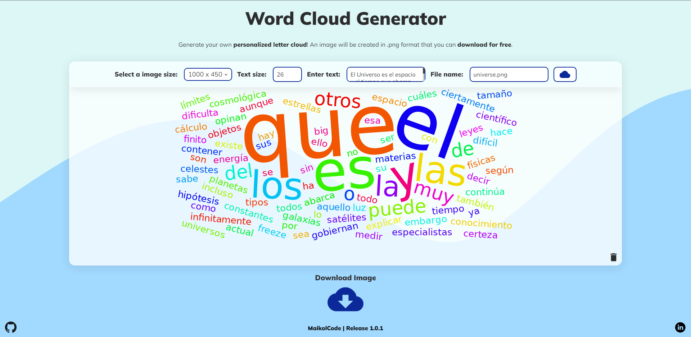

<h1>Welcome to Word Cloud Generator :cloud:</h1>

This project aims to generate a user customizable word cloud. :paperclip:

[Demo](https://word-cloud-gen.netlify.app/cloud-generator){:target="_blank"}

<h2>Starting! :hammer:</h2>

This project is made with <b>Angular 14+</b>, using SCSS as a style compiler and TypeScript. :heavy_check_mark:</br>

A public api is consumed to generate the word clouds. -> [QuickChart](https://quickchart.io/documentation/word-cloud-api/){:target="\_blank"} :man_technologist:

<h2>Build :bulb:</h2>

To start our project locally we must open a terminal of our choice and execute the following command. :wrench: </br>

```
    > git clone https://github.com/Maikolcode/cloud-generator.git
    > cd cloud-generator
    > npm i
    > ng serve -o
```

<h2>Deploy :rocket:</h2>

To deploy and test our application in a public web environment we can use <b>Netlify</b>, which offers us a free hosting service, where we can carry out the tests.

Regarding the hosting process, it is done directly on the official Netlify page, [more information](https://www.netlify.com/){:target="\_blank"}.:heavy_check_mark:

<h2>Libraries :hammer:</h2>

The following resources were used:

- Angular Material :boom:
- NgSelect :raised_hands:

<h3> Angular functionalities </h3>

For optimal development use:

- Routing :muscle:
- HttpClient :earth_americas:
- Interceptor :detective:
- Forms :sunglasses:

<h2>Preview :eyes:</h2>



<h2>Authors :pushpin:</h2>

For the elaboration of the project were influential:

- Michael Parra -> _Creation and Deployment_

- QuickChart - _API Provider_ - [API](https://quickchart.io/documentation/word-cloud-api/){:target="\_blank"}
